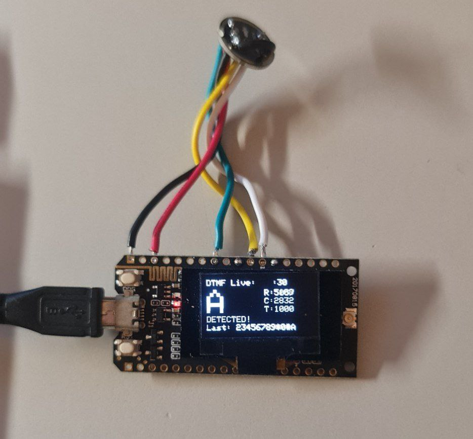

# DTMF Listener - Open Source Hardware

A real-time DTMF (Dual-Tone Multi-Frequency) detection system built with ESP32 that can detect and decode telephone keypad tones. The system uses digital signal processing to identify DTMF signals and displays the detected digits on an integrated display.

[](https://cern-ohl.web.cern.ch/)

## Overview

Detects telephone keypad tones (0-9, *, #, A-D) using just two modules and 5 wire connections.

**Total cost: $11-20 USD | Assembly time: 10 minutes**

## Features

- **Real-time DTMF Detection**: Detects standard telephone keypad tones (0-9, *, #, A-D)
- **Visual Feedback**: Display shows detected digits and signal strength
- **Audio Level Monitoring**: Real-time audio input monitoring with visual indicators
- **History Tracking**: Maintains a history of the last 12 detected digits
- **Debug Mode**: Comprehensive debugging tools for troubleshooting
- **Serial Commands**: Interactive commands for testing and configuration

## Hardware Prototype



*The assembled DTMF Listener showing the ESP32, I2S microphone, and display in action.*

## Required Hardware

### ESP32 Board with Integrated Display
Choose one:

- **Heltec WiFi Kit 32** - 128x64 OLED, ~$10-15
- **TTGO T-Display** - 135x240 TFT color, ~$8-12  
- **LILYGO T5 V2.3** - 2.13" e-paper, ~$12-18

### Microphone Module
- **INMP441 I2S Digital Microphone** - ~$3-5
- **Important**: Must be an I2S digital microphone, not analog

## Wiring (5 connections)

| ESP32 Pin | INMP441 Pin | Function        | Wire Color |
| --------- | ----------- | --------------- | ---------- |
| 3.3V      | VDD         | Power           | Red        |
| GND       | GND         | Ground          | Black      |
| GND       | L/R         | Channel         | Black      |
| GPIO 25   | WS          | I2S Word Select | Yellow     |
| GPIO 33   | SCK         | I2S Clock       | Green      |
| GPIO 34   | SD          | I2S Data        | Blue       |

**📋 For detailed wiring instructions and troubleshooting, see [hardware/docs/wiring_guide.md](hardware/docs/wiring_guide.md)**

## Board-Specific Display Pins (Pre-connected)

| Board              | Display SDA | Display SCL | Display RST |
| ------------------ | ----------- | ----------- | ----------- |
| Heltec WiFi Kit 32 | GPIO 4      | GPIO 15     | GPIO 16     |
| TTGO T-Display     | GPIO 21     | GPIO 22     | GPIO 4      |
| LILYGO T5 V2.3     | GPIO 21     | GPIO 22     | GPIO 16     |

## Assembly

1. **Power**: Connect ESP32 3.3V and GND to INMP441 VDD and GND
2. **I2S**: Connect GPIO 25→WS, GPIO 33→SCK, GPIO 34→SD  
3. **Channel**: Connect ESP32 GND to INMP441 L/R
4. **Test**: Upload firmware and test with DTMF tones

## Installation

### Prerequisites
- [PlatformIO](https://platformio.org/) (recommended) or [Arduino IDE](https://www.arduino.cc/en/software) 
- Required libraries will be automatically managed by PlatformIO

### Setup Steps (PlatformIO - Recommended)

1. **Install PlatformIO**
   - Download [PlatformIO IDE](https://platformio.org/platformio-ide) or install PlatformIO Core
   - Or install as VS Code extension: [PlatformIO IDE for VSCode](https://platformio.org/install/ide?install=vscode)

2. **Clone/Download Project**
   ```bash
   git clone https://github.com/paulpaul168/dtmf-listener-hardware.git
   cd dtmf-listener-hardware
   ```

3. **Configure for Your Board**
   - Edit `platformio.ini` to select your board:
   ```ini
   [env:heltec_wifi_kit_32]
   platform = espressif32
   board = heltec_wifi_kit_32
   framework = arduino
   lib_deps = 
       heltecautomation/Heltec ESP32 Dev-Boards
   
   [env:ttgo-t-display]
   platform = espressif32
   board = ttgo-t1
   framework = arduino
   lib_deps = 
       bodmer/TFT_eSPI
   
   [env:lilygo-t5-v2_3]
   platform = espressif32
   board = esp32dev
   framework = arduino
   lib_deps = 
       zinggjm/GxEPD2
   ```

4. **Build and Upload**
   ```bash
   pio run --target upload
   ```

### Alternative Setup (Arduino IDE)

**📋 For detailed Arduino IDE setup instructions, see [arduino_setup.md](arduino_setup.md)**

1. **Install ESP32 Board Support**
   ```
   File → Preferences → Additional Board Manager URLs
   Add: https://dl.espressif.com/dl/package_esp32_index.json
   Tools → Board → Boards Manager → Search "ESP32" → Install
   ```

2. **Install Board-Specific Libraries**
   - Heltec: `Heltec ESP32 Dev-Boards`
   - TTGO: `TFT_eSPI`
   - LILYGO: `GxEPD2`

3. **Upload Code**
   - Open appropriate firmware file for your board
   - Select your ESP32 board: `Tools → Board → ESP32 Arduino → ESP32 Dev Module`
   - Select correct port: `Tools → Port → [Your ESP32 Port]`
   - Upload the code

## Configuration Examples

### PlatformIO Configuration (platformio.ini)

```ini
[env:heltec_wifi_kit_32]
platform = espressif32
board = heltec_wifi_kit_32
framework = arduino
lib_deps = 
    heltecautomation/Heltec ESP32 Dev-Boards

[env:ttgo-t-display]
platform = espressif32
board = ttgo-t1
framework = arduino
lib_deps = 
    bodmer/TFT_eSPI

[env:lilygo-t5-v2_3]
platform = espressif32
board = esp32dev
framework = arduino
lib_deps = 
    zinggjm/GxEPD2
```

### Arduino IDE Pin Definitions

**Heltec WiFi Kit 32:**
```cpp
#define OLED_SDA    4
#define OLED_SCL    15  
#define OLED_RST    16
#define I2S_WS_PIN  25
#define I2S_SCK_PIN 33
#define I2S_SD_PIN  34
```

**TTGO T-Display:**
```cpp
#define TFT_CS      5
#define TFT_DC      16
#define TFT_RST     23
#define I2S_WS_PIN  25
#define I2S_SCK_PIN 33
#define I2S_SD_PIN  34
```

## Usage

### Basic Operation

1. **Power on** the ESP32 with all connections made
2. **Monitor Serial Output** at 115200 baud for system status
3. **Generate DTMF Tones** using:
   - Phone dialer apps
   - Online DTMF tone generators
   - Actual telephone keypad
4. **View Results** on the display and serial monitor

### Serial Commands

| Command | Description                   |
| ------- | ----------------------------- |
| `d`     | Toggle debug mode on/off      |
| `s`     | Show raw audio samples        |
| `t`     | Run 10-second microphone test |
| `r`     | Reset I2S audio driver        |

### Display Information

The display shows:
- **Large Digit**: Currently detected DTMF digit
- **Signal Levels**: Row (R) and Column (C) frequency magnitudes
- **Threshold**: Current detection threshold (T)
- **Status**: Detection status (Listening/Signal/DETECTED!)
- **History**: Last 12 detected digits

## DTMF Frequencies

| Key | Row Hz | Col Hz | Key | Row Hz | Col Hz |
| --- | ------ | ------ | --- | ------ | ------ |
| 1   | 697    | 1209   | 2   | 697    | 1336   |
| 3   | 697    | 1477   | A   | 697    | 1633   |
| 4   | 770    | 1209   | 5   | 770    | 1336   |
| 6   | 770    | 1477   | B   | 770    | 1633   |
| 7   | 852    | 1209   | 8   | 852    | 1336   |
| 9   | 852    | 1477   | C   | 852    | 1633   |
| *   | 941    | 1209   | 0   | 941    | 1336   |
| #   | 941    | 1477   | D   | 941    | 1633   |

## Troubleshooting

### No Audio Detection
- Verify microphone power (3.3V, **not 5V**)
- Check L/R pin connected to GND
- Ensure all I2S pin connections are secure
- Confirm microphone is I2S digital type
- Use `t` command to test microphone

### Poor Detection Accuracy
- Increase audio input volume
- Move microphone closer to audio source
- Reduce background noise
- Check for loose connections
- Try different DTMF tone generator

### Display Issues
- Verify correct board selected in Arduino IDE
- Check display power (3.3V)
- Ensure correct display library installed
- Try different USB cable or port

## Technical Details

### Signal Processing
- **Algorithm**: Goertzel algorithm for frequency detection
- **Sample Rate**: 8000 Hz
- **Buffer Size**: 1024 samples
- **Detection Method**: Dual-frequency magnitude comparison

### Configuration
- **Detection Threshold**: 1000.0 (adjustable in code)
- **Display Update Rate**: 100ms
- **History Size**: 12 digits maximum

## Board Comparison

| Feature           | Heltec WiFi Kit 32 | TTGO T-Display  | LILYGO T5 V2.3     |
| ----------------- | ------------------ | --------------- | ------------------ |
| Display Type      | OLED Monochrome    | TFT Color       | E-Paper Monochrome |
| Display Size      | 0.96" (128x64)     | 1.14" (135x240) | 2.13" (250x122)    |
| Power Consumption | Low                | Medium          | Ultra Low          |
| Refresh Rate      | Fast               | Fast            | Slow               |
| Cost              | Medium             | Low             | High               |
| Best Use          | General purpose    | Colorful UI     | Battery projects   |


## Contributing

1. Fork the repository
2. Create a feature branch (`git checkout -b feature/amazing-feature`)
3. Commit your changes (`git commit -m 'Add amazing feature'`)
4. Push to the branch (`git push origin feature/amazing-feature`)
5. Open a Pull Request

## License

- **Hardware**: CERN-OHL-W
- **Firmware**: MIT  
- **Documentation**: CC BY-SA 4.0

## Acknowledgments

- DTMF detection based on Goertzel algorithm implementation
- Board manufacturers for excellent ESP32+display integration
- ESP32 community for I2S audio examples

## Version History

**v1.0**: Initial release with basic DTMF detection
- Real-time frequency analysis
- Integrated display support
- Serial command interface
- Microphone testing tools
